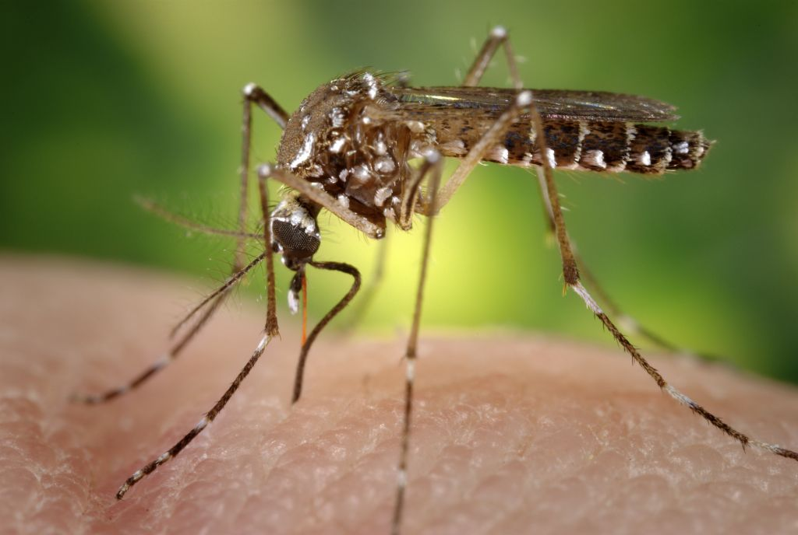

# 🦟 DengAI — Predicting Disease Spread

A machine learning project to predict **weekly dengue fever cases** in two cities (**San Juan** and **Iquitos**) using environmental and weather features.

## 🔗 Quick Links

- Notebook: `NoteBook/DengAI_Predicting_Disease_Spread_Final.ipynb`
- README: `README.md`
- Presentation: `Documents/DengAI_Project_Presentation.pptx`
- Submission: `Data/submission.csv`

---

## 📌 Project Overview

Dengue transmission is strongly linked to climate and environmental conditions. This project builds and compares multiple regression models to forecast weekly dengue cases from historical data.

### Objectives

- Explore and understand the dengue dataset
- Clean and preprocess missing values
- Engineer useful time and seasonal features
- Compare multiple ML regression models
- Tune the best model using grid search
- Generate test predictions and a submission file

---

## 🗂️ Dataset

Located in `Data/`:

- `dengue_features_train.csv`
- `dengue_labels_train.csv`
- `dengue_features_test.csv`
- `submission_format.csv`
- `submission.csv` (generated)

### Target

- `total_cases` — number of weekly dengue cases

### Scope

- Cities: `sj` (San Juan), `iq` (Iquitos)
- Time range: 1990–2013 (train + test timeline)

---

## 🧠 Methods Used

### Data Processing

- Missing value treatment (median imputation)
- Date conversion from `week_start_date`
- Feature engineering:
  - `month`
  - `day_of_year`
  - One-hot encoded city/season features

### Models Compared

- Linear Regression
- Ridge Regression
- Lasso Regression
- Decision Tree Regressor
- Random Forest Regressor
- Gradient Boosting Regressor
- XGBoost Regressor
- AdaBoost Regressor
- KNN Regressor
- SVR

### Model Selection

- Train/validation split
- Metrics:
  - MAE (Mean Absolute Error)
  - R² score
- Hyperparameter tuning with `GridSearchCV` for XGBoost
- 5-fold cross-validation on tuned model

---

## ✅ Final Results

**Best model:** Tuned XGBoost

- Validation MAE: **12.16**
- Validation R²: **0.745**
- Cross-validation MAE (mean): **10.71**

This indicates strong predictive performance for weekly case forecasting with room for future improvements.

---

## 🖼️ Key Visual Outputs

Saved in `Image/`:

- `01_target_analysis.png`
- `02_model_comparison_mae.png`
- `03_feature_importance.png`
- `04_validation_actual_vs_predicted.png`
- `05_city_month_heatmap.png`
- `06_residual_diagnostics.png`
- `07_yearly_trend_by_city.png`

---

## 📓 Notebook

Main notebook:

- `NoteBook/DengAI_Predicting_Disease_Spread_Final.ipynb`

Includes:

- EDA
- preprocessing
- model training/comparison
- tuning and validation
- prediction generation
- executive summary and presentation-ready conclusion

---

## 🚀 How to Run

1. Open the notebook in VS Code / Jupyter.
2. Use the project virtual environment (`.venv`).
3. Run all cells from top to bottom.
4. Check generated outputs:
   - `Data/submission.csv`
   - `Image/*.png`

---

## 📊 Deliverables

- Final notebook with analysis and conclusions
- Submission file for competition format
- Exported professional graphs
- PowerPoint presentation for project reporting

---

## 🖥️ Presentation

A comprehensive presentation deck is included:

- `Documents/DengAI_Project_Presentation.pptx`

To regenerate it after updating figures, run:

1. Ensure images exist in `Image/`
2. Run `Documents/generate_presentation.py`

---

## 🔮 Future Improvements

- Add lag and rolling-window features
- Train city-specific models
- Use time-series CV for stronger temporal evaluation
- Add uncertainty intervals for risk-aware planning

---

## 👨‍💻 Author

Assimagbe Albert Raphael

---

## 📚 Citation

If you use this work, please cite it as:

`DengAI — Predicting Disease Spread (2026). Machine learning pipeline for weekly dengue case forecasting using environmental features.`

Source competition/data reference:

- DrivenData. *DengAI: Predicting Disease Spread*.
  [https://www.drivendata.org/competitions/44/dengai-predicting-disease-spread/](https://www.drivendata.org/competitions/44/dengai-predicting-disease-spread/)
